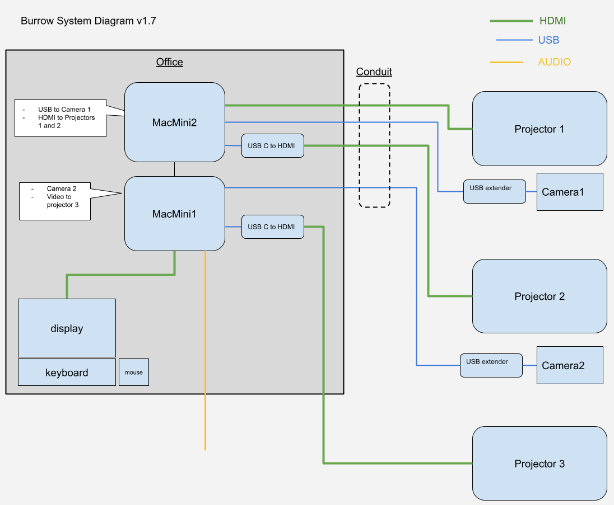

# BURROW



Runs as two TD projects across one or two machines.  
Machines communicate over OSC.  One camera/sensor per machine.

## Inputs:
 
- 2 IR cameras

## Outputs:
 
- 3 projection mapped HD video outputs
- 1 GUI Window
- Stereo audio

## Assets

Assets required in ASSETS folder in root of this repository and structured as below:

```
ASSETS/
	black.png
	mask main.png
	mask opposite.png

	idle/
		idle-main.mp4
		idle-opposite.mp4  
		
	active/
		active-main.mp4
		active-opposite.mp4  
		active.wav
		
	hotspot01/
		oneshot.wav
		
		main/ 
			hotspot[001-xxx].png
			
		opposite/
			hotspot[001-xxx].png 
			
	hotspot02/
		oneshot.wav
		
		main/ 
			hotspot[001-xxx].png
			
		opposite/
			hotspot[001-xxx].png 
		
	hotspot03/
		oneshot.wav
		
		main/ 
			hotspot[001-xxx].png
			
		opposite/
			hotspot[001-xxx].png 
		
```

